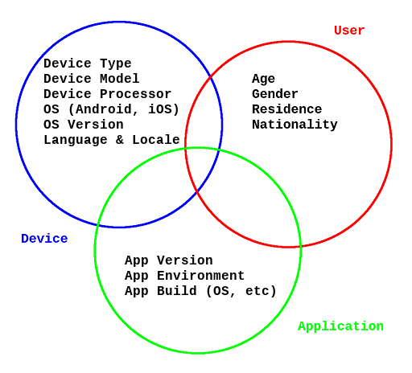

# Logging

Investigate the details to be logged to facilitate debugging/analytics

## Overview

As the following diagram shows, there are a number of areas to consider:

Broadly speaking (ignoring historical details such `First Launch Time`,
`Cellular Service Provider`, etc) these fall into three categories:

1. [User](#user)
2. [Device](#device)
3. [Application](#application)

These categories overlap to a certain extent (this is not shown on the diagram).

## User

Mainly useful for demographic/analytic/marketing purposes:

* Age (or Age Group)
* Gender
* Residence
* Nationality

[Probably depend upon Apple App Store / Google Play Store reporting for these.]

## Device

Mostly useful for testing/debugging purposes, but also of interest for
demographic/analytic/marketing purposes:

* Device Type
* Device Model
* Device Processor
* Operating System (Android, iOS)
* Operating System version
* Language & Locale (local does not have to be present)

Android devices have a more limited form-factor, but many more suppliers
(each of which may trail Official Android releases by quite some effort).

Android devices generally fall into three broad processor types [it is
non-trivial to determine the processor type from the model, but this is
something that Google Play Store reporting probably handles].

iOS devices come in a wide variety of form factors, but are generally a
lot more restricted in terms of generally being up-to-date with the
latest iOS release (but might trail by a release or two).

Device Type / Device Processor / Operating System are necessary to
isolate the particular app build that may be problematic.

Language (English, French) is a user setting, but is listed here as a
device characteristic. Locale may not be present, but is generally a
sub-category of language (en_US, fr_FR, etc).

## Application

Mainly of interest for debugging/maintenance purposes, but also of
interest for demographic/analytic/marketing purposes:

* App Version
* App Environment
* App Build (OS, processor type, etc)

These are all critical for triage of bug/crash reports (generally,
bug/crash reports that originate from a `development` environment
are not investigated. Staging, QA and Production environments are
progressively more critical).

This would also be the category where we might introduce app-specific
event details (highly-active or engaged users, for example) that are
of particular interest for future marketing efforts (these remain to
be defined).

## To Do

- [ ] Add more details as they are discovered
- [ ] Add more application event details as they are defined
