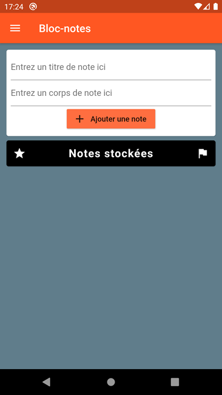
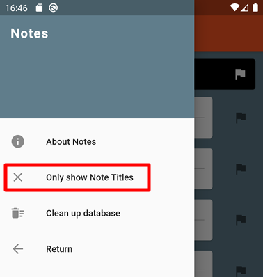

# Test Plan

A test plan to verify proper functioning of Notes application

## Contents

The contents are as follows:

* [Initial app](#initial-app)
* [Adding Notes](#adding-notes)
    * [Add note validation](#add-note-validation)
* [Tooltips](#tooltips)
* [Filtering](#filtering)
    * [Star Filter](#star-filter)
    * [Star and Flag Filter](#star-and-flag-filter)
    * [Flag Filter](#flag-filter)
    * [No filtering](#no-filtering)
* [Scrolling](#scrolling)
* [Updating Notes](#updating-notes)
    * [Update note validation](#update-note-validation)
* [Deleting Notes](#deleting-notes)
    * [Left to Right](#left-to-right)
    * [Non-deletion](#non-deletion)
    * [Clean up Notes](#clean-up-notes)
* [Menu items](#menu-items)
    * [About Notes](#about-notes)
    * [Only show Note Titles](#only-show-note-titles)
    * [Clean up database](#clean-up-database)
* [Monitoring](#monitoring)
    * [Ongoing](#ongoing)
    * [Crashlytics/Sentry setup](#crashlyticssentry-setup)
    * [Debugging/Staging/Production](#debuggingstagingproduction)
    * [Release tagging](#release-tagging)
* [To Do](#to-do)

## Initial app

After installation, the app should look as follows:

## Adding Notes

Add four notes as shown:

#### Add note validation

Verify that a note must have ___either___ a title ___or___ a body.

## Tooltips

Long press the following items as shown:

1. Star filter
2. Flag filter
3. Note Star
4. Note Flag

Verify that an appropriate tooltip appears.

## Filtering

Flag/Star the individual notes as shown:

#### Star Filter

Select the 'star' filter. Verify the results are as shown:

#### Star and Flag Filter

Select the 'flag' filter. Verify the results are as shown:

#### Flag Filter

Deselect the 'star' filter. Verify the results are as shown:

#### No filtering

Deselect the 'flag' filter. Verify the results are as shown:

## Scrolling

Add some more notes.

Verify scrolling works correctly.

## Updating Notes

Update some notes (double-tap the note body to switch to the Update Note screen).

Verify updating notes works correctly.

#### Update note validation

Verify that a note must have ___either___ a title ___or___ a body.

## Deleting Notes

It can be quite easy to accidentally delete a note (often without being
aware of having done so).

Accordingly, a number of safeguards have been put in place to prevent
against this.

#### Left to Right

Notes can only be deleted by swiping from __Right__ to __Left__.

Verify that swiping a note from __Left__ to __Right__ does nothing.

#### Non-deletion

In order to prevent against accidental deletion of notes, the swipe
must be decisive in order for the note to be deleted.

Swipe a note approximately 10 percent of the way across the screen:

And release it. Verify that the note does not get deleted.

Swipe a note approximately 50 percent of the way across the screen:

And release it. Verify that the note ___does___ get deleted.

Verify that there is an informational message indicating that the
note has been deleted.

#### Clean up Notes

Finally, to clean up, delete all remaining notes.

The app should now be back in its ___as installed___ state:

## Menu items

Open the menu and verify the following items.

#### About Notes

Select the 'About Notes' option.

Verify the about popup shows.

Close the popup.

#### Only show Note Titles

[To run these tests, an AVD set to `Nexus 5X (portrait mode)` will be helpful.]

By default, the __Only show Note Titles__ option should be disabled:

Verify that selecting the __Only show Note Titles__ option affects the scrolling
display such that only note titles are shown:

Select the Return option and verify that note bodies are not shown:

Re-open the menu and disable the __Only show Note Titles__ option.

#### Clean up database

Select the 'Clean up database' option.

Verify that it doesn't crash.

## Monitoring

Verify that there have been no crash reports in Crashlytics/Sentry.

#### Ongoing

Monitor Crashlytics/Sentry on an ongoing basis for crash reports.

#### Crashlytics/Sentry setup

The project should be added to Crashlytics/Sentry as early as possible to verify proper function.

[Bug/Crash reports tend to be intermittent and/or sporadic, so best to have strong confidence in their reporting.]

#### Debugging/Staging/Production

It is sometimes possible to separate these (bug/crash reports when developing are not normally serious).

But for practical reasons it is probably best to always have bug/crash reporting enabled during development.

#### Release tagging

In order to be better able to ___triage___ bug/crash reports, robust release versions (and tagging) should be employed.

[SemVer](http://semver.org/) release versions should be used for each release.

## To Do

- [ ] Automate this testing
- [ ] Verify that everything works in offline mode - Android
- [ ] Verify that everything works in offline mode - iOS
- [ ] Incorporate into CI/CD pipeline
